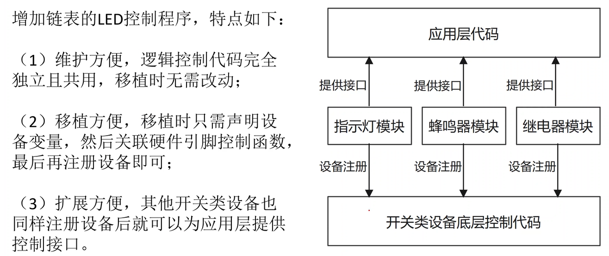

[TOC]

# 面向对象的编程思想
## 情景
假设需要控制300个LED的点亮/熄灭
## 最无脑的编程思维

```c
LED1(int sta)
{
    switch(sta)
    {
        case 0: /*熄灭;*/break;
        case 1: /*点亮;*/break;
    }
}
LED2(int sta)
{
    switch(sta)
    {
        case 0: /*熄灭;*/break;
        case 1: /*点亮;*/break;
    }
}
.
.
.
LED300(int sta)
{
    switch(sta)
    {
        case 0: /*熄灭;*/break;
        case 1: /*点亮;*/break;
    }
}
```
## 初步改进1
```C
void LED_Ctrl(int led_no, int sta)
{
    if(sta==1)
    {
         switch(led_no)
        {
            case 0: /*点亮LED0;*/break;
            case 1: /*点亮LED1;*/break;
            .
            .
            .
            case 300: /*点亮LED300;*/break;
        }
    }
    else if(sta == 0)
    {
        switch(led_no)
        {
            case 0: /*熄灭LED0;*/break;
            case 1: /*熄灭LED1;*/break;
            .
            .
            .
            case 300: /*熄灭LED300;*/break;
        }
    }
}
```
这种方法虽然能够提供统一的接口，但是内部实现特别繁杂。并且，如果后续LED增加新的功能，还需要修改这个接口函数的内容（即，代码未解耦）。

## 改进2

```C
typedef void (*LEDCtrl)(int,int);
LEDCtrl leds[300] = {NULL,GPIO_LEDCtrl,...,IIC_LEDCtrl,...,SPI_LEDCtrl,...};//函数指针数组

void LED_Ctrl(int led_no, int sta)
{
    leds[led_no](led_no,sta);
}
```
**上述操作的缺点：** 
1. 函数指针数组浪费空间（可使用链表进行动态管理）；
2. 数组中每一项只是一个函数，只能表现一种行为，如果每一个LED都有好几个功能，对应好几个函数怎么办？；
   
## 改进3

```C
typedef struct 
{
    char *name;
    void (*ONorOFF)(struct LED_Dev *p,int sta);
    void (*SetColor)(struct LED_Dev *p,int color);
}LED_Dev, *pLED_Dev;

pLED_Dev leds[300];

int Dev_cnt = 0;

void register_led(pLED_Dev p_new_dev)
{
    leds[cnt] = p_new_dev;
    Dev_cnt++;
}

LED_Dev IIC_LED = {"IIC_LED",IIC_ONorOFF,IIC_SetColor};
register_led(&IIC_LED);

LED_Dev SPI_LED = {"SPI_LED",SPI_ONorOFF,SPI_SetColor};
register_led(&SPI_LED);


```
## 改进4（用链表管理设备）



